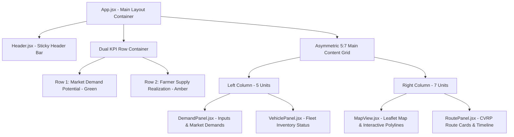

# 🌾 AgriRoute AI Portal — Comprehensive Frontend UI/UX Design Specification

> **System Blueprint & Component Reference**  
> **Version:** 2.4.0 · **Target Stack:** React 18, Vite, Leaflet, Tailwind CSS, Custom Design System  
> **Repository:** [integrated-AI-route](https://github.com/RaunakRaj567/integrated-AI-route)

---

## 1. Executive Summary & Design Philosophy

The **AgriRoute AI Portal** is an advanced agricultural logistics and demand forecasting interface built specifically for farmers, agricultural cooperatives, and fleet operators across the Delhi-NCR region. The design balances **data density** with **tactile clarity**, eliminating unnecessary glassmorphism and drop-shadow clutter in favor of a crisp, parchment-inspired editorial aesthetic.

### Core Design Principles
1. **Parchment & Sage Aesthetic ("Warm Earth"):** Soft cream and parchment backgrounds (`#F4EFE4`, `#FBF8F2`) paired with deep forest and sage greens (`#3A6347`, `#5A8A6A`). Evokes agricultural heritage while maintaining professional software precision.
2. **Flat Border-Based Elevation:** Avoids blurred fuzzy shadows. Card hierarchy and surface elevation are established using crisp `1.5px solid` borders with subtle hue shifts (`--beige-border: #D8CFBA`).
3. **Dual Typographic Contrast:**
   - **Playfair Display:** Elegant serif headers for section identity.
   - **DM Mono:** Monospaced formatting for all numerical outputs, currency, weights, distances, and percentages.
   - **DM Sans:** Clean, highly legible sans-serif for UI controls and body text.
4. **Independent Dual KPI Rows:** Explicit separation between theoretical **Market Capacity Potential** (Green Row 1) and actual **Farmer Supply Financial Realization** (Amber Row 2).
5. **Zero-Guesswork Steppers & Controls:** Direct numeric inputs paired with stepper buttons (`+`/`-`), instant unit toggles (`tons` $\leftrightarrow$ `kg`), and visual upper-limit warnings.

---

## 2. Design Tokens & Visual Hierarchy

### 2.1 Color System

| Token Name | Hex Code | Visual Role | Application Context |
|---|---|---|---|
| `--bg-base` | `#F4EFE4` | Canvas Base | Global page background |
| `--bg-surface` | `#FBF8F2` | Card Surface | Standard panel containers & controls |
| `--bg-raised` | `#FFFDF8` | High Elevation | Input fields, active cards, map container |
| `--green-deep` | `#3A6347` | Anchor Accent | Primary CTA buttons, key metrics, brand icons |
| `--green-mid` | `#5A8A6A` | Primary Sage | Row 1 KPI borders, section highlights, active tabs |
| `--green-light` | `#A8C5B0` | Light Sage | Badge borders, active card outlines |
| `--green-pale` | `#D6EAD9` | Sage Wash | Success banners, highlight backgrounds |
| `--amber-warm` | `#9B6B2A` | Amber Accent | Row 2 Farmer Supply cards, surplus warnings |
| `--amber-pale` | `#F7EDD8` | Amber Wash | Surplus alert containers, warning cards |
| `--red-muted` | `#8B3A3A` | Alert Red | Transport costs, fleet capacity overflow alert |
| `--red-pale` | `#F4DADA` | Alert Wash | Capacity error banners, high-cost tags |
| `--beige-border` | `#D8CFBA` | Structural Divider | 1.5px borders on panels and input fields |
| `--beige-mid` | `#C4B89A` | Neutral Border | Scrollbar thumb, secondary icons |
| `--text-ink` | `#221C0F` | Primary Ink | Headlines, active metric figures |
| `--text-body` | `#4A3F2F` | Body Text | Descriptions, label titles |
| `--text-muted` | `#7D7162` | Muted Text | Secondary metrics, unit indicators |
| `--text-faint` | `#A89B88` | Faint Label | Uppercase caps labels, helper subtext |

### 2.2 Typography Scale

```css
/* Font Families */
--font-display: 'Playfair Display', Georgia, serif;
--font-mono:    'DM Mono', 'Courier New', monospace;
--font-body:    'DM Sans', system-ui, sans-serif;
```

| Class | Font Family | Size | Weight | Line Height | Tracking | Usage |
|---|---|---|---|---|---|---|
| `.text-display-xl` | Playfair Display | 2.25rem (36px) | 700 | 1.1 | Normal | Hero Headings |
| `.text-display-lg` | Playfair Display | 1.75rem (28px) | 700 | 1.15 | Normal | Section Headers |
| `.text-display-md` | Playfair Display | 1.35rem (21.6px) | 700 | 1.2 | Normal | Panel Titles |
| `.text-label-caps` | DM Sans | 0.65rem (10.4px) | 600/700 | 1.0 | `0.1em` | Uppercase Section Labels |
| `.text-data-lg` | DM Mono | 1.5rem (24px) | 500/700 | 1.1 | `-0.01em` | Primary KPI Values |
| `.text-data-md` | DM Mono | 1.1rem (17.6px) | 500/600 | 1.2 | `-0.01em` | Pricing Cards & Capacities |
| `.text-data-sm` | DM Mono | 0.8rem (12.8px) | 400/500 | 1.3 | Normal | Input values, mini badges |

### 2.3 Radius & Grid Spacing
- **Radii:** `var(--radius-xs): 2px`, `var(--radius-sm): 4px`, `var(--radius-md): 8px`, `var(--radius-lg): 16px`.
- **Page Max Width:** `1400px` centered with auto margins.
- **Asymmetric Grid Split:** 5 columns (Farmer Inputs & Fleet) : 7 columns (Interactive Map & Schedules).

---

## 3. Page Structure & Component Architecture



---

## 4. Component-by-Component UI Specification

### 4.1 Header (`Header.jsx`)
Sticky top navigation container spanning the full width (max `1400px` content area).

- **Brand Ident:** `Sprout` icon inside a deep forest box (`#3A6347`), paired with "AgriRoute *AI*" headline (Playfair Display) and subtitle "DEMAND FORECASTING & MULTI-VEHICLE LOGISTICS".
- **Center Banner:** Pill container with `--green-pale` background and `--green-light` border: `"Delhi-NCR Agricultural Optimization Portal"`.
- **Backend Status Indicator:** Real-time pulse dot:
  - **Connected:** Green dot (`--green-mid`), text `"Connected"`.
  - **Connecting/Error:** Amber dot (`#D4A0AA`), text `"Connecting…"`.

---

### 4.2 Dual KPI Dashboard Rows (`App.jsx`)

Located immediately below the header, providing instant dual-perspective financial and operational visibility.

```
┌─────────────────────────────────────────────────────────────────────────────────────────────────────────────┐
│ 📊 Row 1: Full Market Demand Potential (100% Demand Coverage — 109.0 Tons Total Market Capacity)          │
│ ┌──────────────────┬──────────────────┬──────────────────┬──────────────────┬──────────────────┬──────────┐ │
│ │ Total Demand     │ Potential Rev    │ Transport Cost   │ Net Profit       │ Vehicles Req.    │ Travel   │ │
│ │ 109.0 Tons       │ ₹5,668,000       │ ₹51,385          │ ₹5,616,615       │ 5/5 Trucks       │ 9.5 hrs  │ │
│ └──────────────────┴──────────────────┴──────────────────┴──────────────────┴──────────────────┴──────────┘ │
├─────────────────────────────────────────────────────────────────────────────────────────────────────────────┤
│ 🎯 Row 2: Actual Farmer Supply (Optimized for 50.0 Tons Input)                                              │
│ ┌──────────────────┬──────────────────┬──────────────────┬──────────────────┬──────────────────┬──────────┐ │
│ │ Actual Delivered │ Actual Revenue   │ Actual Freight   │ Actual Profit    │ Fleet Deployed   │ Delivery │ │
│ │ 50.0 Tons        │ ₹2,600,000       │ ₹25,000          │ ₹2,575,000       │ 2/5 Trucks       │ 4.2 hrs  │ │
│ └──────────────────┴──────────────────┴──────────────────┴──────────────────┴──────────────────┴──────────┘ │
└─────────────────────────────────────────────────────────────────────────────────────────────────────────────┘
```

#### Row 1 — Market Potential (Green Border Accent)
Calculated **100% independently** from raw ML forecast market capacity (`rawDemands`).
- **Total Market Demand:** Sum of all raw ML mandi demands in tons.
- **Market Potential Revenue:** Sum of $\text{rawDemand}_m \times \text{ML\_Price}_m \times (1 + \text{markup}\%)$.
- **Full Transport Cost:** Baseline fixed distance (513.85 km) $\times$ ₹100/km = ₹51,385.
- **Market Net Profit:** Potential Revenue $-$ Transport Cost.
- **Vehicles Required:** Full fleet requirement (5 trucks if $>90\text{t}$).
- **Travel Time:** Baseline full route duration (9.5 hrs).

#### Row 2 — Actual Farmer Supply (Amber Border Accent)
Locked to the last executed **Optimization run** (`masterResult`). Does **not** recalculate transiently while typing in the input box to prevent visual jumpiness.
- **Actual Supply Delivered:** Allocated cargo tonnage ($\text{allocated\_kg} / 1000$).
- **Actual Revenue Yield:** Financial revenue realized from delivered supply.
- **Actual Transport Cost:** Real logistics freight cost calculated by OR-Tools & OSRM.
- **Actual Net Profit:** Actual Revenue $-$ Actual Transport Cost.
- **Fleet Deployed:** Number of active trucks utilized out of 5.
- **Surplus/Warehouse Leftover:** Tonnage exceeding market demand ($\max(0, \text{Available Supply} - \text{Market Total Demand})$).

---

### 4.3 Farmer Control & Demand Panel (`DemandPanel.jsx`)

Located in the left column. Encapsulates all user parameters, crop metadata, dynamic pricing, and market demand steppers.

#### 1. Panel Header & Unit Toggle
- Panel Title: `"Farmer Inputs"`
- Unit Toggle Switch: `[ tons | kg ]` segmented button. Toggling dynamically transforms all input fields, labels, steppers, and tooltips between metric tons and kilograms.

#### 2. Crop & Date Controls
- **Crop Selector Dropdown:** Options: `Wheat 🌾`, `Rice 🍚`, `Onion 🧅`, `Maize 🌽`.
- **Prediction Date Picker:** HTML5 date input restricted to `min = Today` to ensure past dates cannot be selected.

#### 3. Crop Pricing Context Card
Dynamic background and border tailored per selected crop metadata:
- **Wheat:** Beige Tint (`#FBF5E0`), Border (`#D4BC72`). Base: ₹34.0/kg.
- **Onion:** Crimson Tint (`#FAE8E8`), Border (`#D4A0A0`). Base: ₹50.0/kg.
- **Rice:** Sage Tint (`#E8F4EC`), Border (`#9DC9A8`). Base: ₹48.0/kg.
- **Maize:** Golden Tint (`#FEF9E7`), Border (`#E6C687`). Base: ₹24.0/kg.

Card highlights:
- **Cost of 1 Ton:** Monospaced display of effective cost per ton after markup.
- **Transport Rate:** Fixed benchmark ₹100/km (₹10.00 / ton-km freight).

#### 4. Total Available Supply & Leftover Warehouse Storage
- Numeric input field for farmer's total crop harvest.
- Displays upper transport capacity cap reminder: **125t Fleet Limit**.
- **Leftover Supply (Surplus) Container:**
  $$\text{Leftover Supply} = \max(0, \text{Total Available Supply} - \text{Market Total Demand})$$
  - If supply exceeds demand: Highlights in amber, displays excess tonnage, and unlocks the **"Store Leftover in Warehouse (Phase 2)"** action button.
  - If supply is less than demand: Displays confirmation that 100% of supply will be allocated across markets in exact proportion to demand.

#### 5. Selling Price Markup Slider (SP%)
- Range: `0%` to `+10%` with step `0.5%`.
- Live preview showing marked-up selling price per kg.

#### 6. Market Demands Table & Stepper Inputs
Scrollable list of Delhi-NCR mandi destinations (Azadpur, Ghazipur, Okhla, Najafgarh, Narendrapur, Shahdara, Keshopur):
- Displays Mandi Name, ML Predicted Price badge (`₹X/kg`), and **Sideways Market Demand** (`Mkt Demand: X.Xt`).
- Stepper controls (`-` / `+`) allowing custom manual override adjustments per mandi.

#### 7. Action Button Suite
- **Fetch Crop Forecast:** Triggers ML demand prediction API (`/api/forecast`).
- **Optimize Profit:** Runs Linear Programming supply allocation (`/api/optimize-profit`).
- **Optimize CVRP Routes:** Solves Capacitated Vehicle Routing Problem (`/api/routes`).
- **Full End-to-End Optimization:** Single-click execution of complete pipeline (Forecast $\rightarrow$ LP Allocation $\rightarrow$ CVRP Routing $\rightarrow$ Dual KPI updates).

---

### 4.4 Fleet Inventory Panel (`VehiclePanel.jsx`)

Located below the DemandPanel in the left column.

- **Capacity Alert Banner:**
  - **Sufficient Capacity:** Green banner displaying `"Fleet capacity sufficient (125t vs Demand X.Xt)"`.
  - **Capacity Deficit:** Red alert banner displaying `"Capacity alert — demand exceeds fleet!"`.
- **5-Truck Fleet Roster:**
  - **Truck 1:** 20,000 kg (20t) — Royal Blue (`#2563eb`)
  - **Truck 2:** 22,000 kg (22t) — Purple (`#7c3aed`)
  - **Truck 3:** 25,000 kg (25t) — Emerald Green (`#059669`)
  - **Truck 4:** 28,000 kg (28t) — Bright Orange (`#ea580c`)
  - **Truck 5:** 30,000 kg (30t) — Crimson Red (`#e11d48`)
- Status pills: Displays `"X.Xt loaded"` when deployed, or `"standby"` when inactive.

---

### 4.5 Interactive Route Map (`MapView.jsx`)

Located in the top right column. Built with Leaflet & React-Leaflet.

- **Map Container Height:** Fixed `560px` with rounded `8px` borders.
- **Top Route Selector Ribbon:** Horizontal bar allowing filtering by specific truck routes or `"Show All (X Trucks)"`.
- **Custom Location Pins:**
  - **Central Depot (Delhi):** Red circular icon with warehouse symbol (`🏬`).
  - **Active Mandis:** Green rounded pill showing allocated cargo (e.g., `25.5t`).
  - **Inactive Mandis:** Gray rounded pill showing `0`.
- **Interactive Polylines:** Real road geometry fetched from OSRM engine. Clicking a polyline highlights the route with a 12px outer glow and dims all non-selected routes.
- **Floating Map Legend:** Bottom-right glassmorphic overlay detailing depot, delivery markets, and active truck routes.

---

### 4.6 Route Schedule & Logistics Panel (`RoutePanel.jsx`)

Located below the MapView in the right column.

- **Logistics Summary Strip:** 4 compact cards displaying:
  1. **Cargo Delivered** (tons & kg)
  2. **Total Road Distance** (km)
  3. **Est. Travel Time** (hours & minutes)
  4. **Fleet Utilization** (% & active trucks count)
- **Detailed Route Cards:** Card per active truck detailing:
  - Vehicle capacity progress bar (percentage filled & color-coded).
  - Sequenced path chips (`Delhi` $\rightarrow$ `Mandi A` $\rightarrow$ `Mandi B` $\rightarrow$ `Delhi`).
  - Distance (km) and driving time per individual truck.
  - Interactive click state synced bidirectionally with the MapView.

---

## 5. Micro-Interactions & State Architecture

### 5.1 Key Application State (`App.jsx`)

```javascript
// State Definitions
const [crop, setCrop] = useState('Wheat');
const [date, setDate] = useState(todayStr);
const [availableSupply, setAvailableSupply] = useState(50000); // in kg
const [priceMarkup, setPriceMarkup] = useState(0); // in %
const [rawDemands, setRawDemands] = useState({}); // Frozen ML Forecast capacity
const [demands, setDemands] = useState({}); // User/Allocated mandi loads
const [predictedPrices, setPredictedPrices] = useState({});
const [masterResult, setMasterResult] = useState(null); // Full optimization response
const [selectedVehicleId, setSelectedVehicleId] = useState(null);
```

### 5.2 Responsive Breakpoint Strategy
- **Desktop (> 1024px):** Asymmetric 5:7 grid layout. Dual KPI rows render in full 6-column grid.
- **Tablet & Mobile ($\le$ 1024px):** Single-column stacked layout (`grid-template-columns: 1fr`). KPI blocks collapse into 2-column or 3-column wrap grids. Map height adjusts to `400px`.

---

## 6. Summary of UI Design System Compliance

| UI Aspect | Implementation Standard | Status |
|---|---|---|
| **Palette** | Parchment (`#F4EFE4`) + Sage (`#5A8A6A`) + Forest (`#3A6347`) | ✅ Standardized |
| **Borders** | Flat 1.5px solid `--beige-border` (No box-shadows) | ✅ Standardized |
| **Typography** | Playfair Display (Headers), DM Mono (Data), DM Sans (Body) | ✅ Standardized |
| **Dual KPI Rows** | Row 1 (ML Forecast) vs Row 2 (Farmer Supply - Master Locked) | ✅ Implemented |
| **Leftover Supply** | $\text{Available Supply} - \text{Market Total Demand}$ + Phase 2 Button | ✅ Implemented |
| **Map Sync** | Polyline glow & card click sync | ✅ Implemented |
| **Build Status** | Vite Production Build (0 errors) | ✅ Verified |
